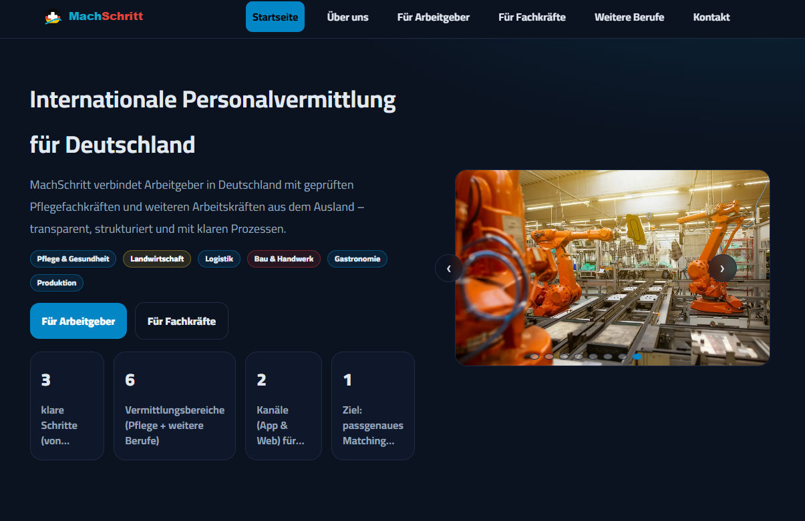
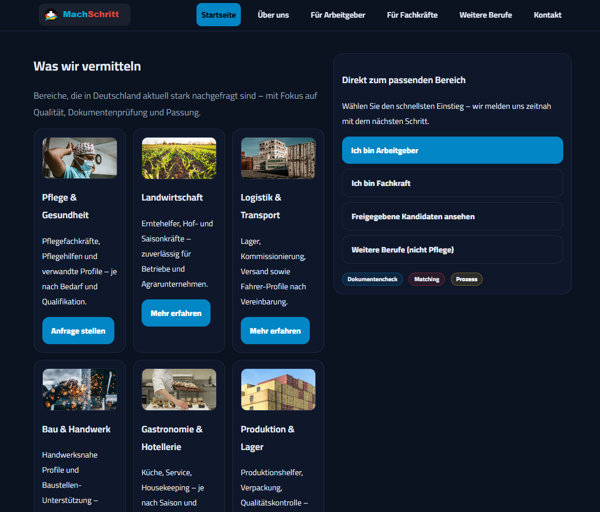
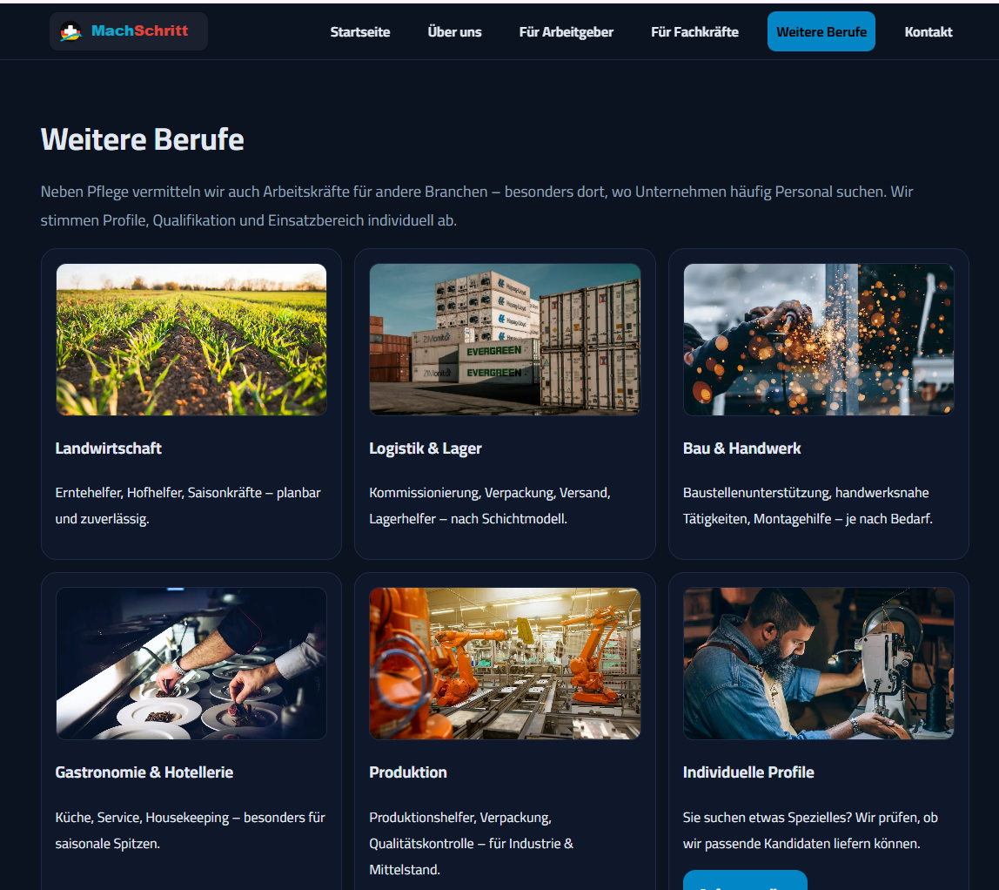
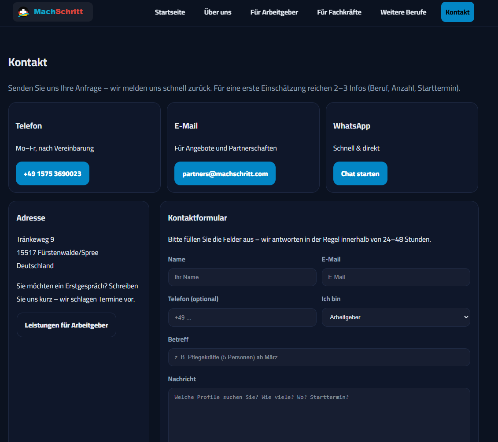

# MachSchritt Website

A responsive business website for **MachSchritt**, a company focused on international recruitment and consulting services between Egypt and Germany.

The project presents information for employers, candidates and visitors in a clear and structured way. It includes multiple pages, a contact section and a candidate-oriented service structure.

---

## Live Demo

(https://machschritt.com/)

---

## Screenshot

---

## Features

* Responsive multi-page website
* Homepage with company introduction
* Pages for employers and candidates
* Contact page with structured form layout
* Clean navigation and user-friendly content structure
* German business-oriented website content

---

## Pages

* Home
* About
* Clients / Employers
* Talents / Candidates
* Contact
* Privacy Policy
* Imprint

---

## Technologies Used

* HTML
* CSS
* JavaScript

---

## What I Learned

Through this project, I practiced building a real business website with multiple pages, structured content and a user-friendly layout.
I also improved my understanding of HTML, CSS, JavaScript, responsive design and website organization.

---

## Project Goal

The goal of this project was to create a practical website for a real business use case and improve my skills step by step as an aspiring software developer.

---

## Author

**Islam Albadawy**
Aspiring Software Developer 
